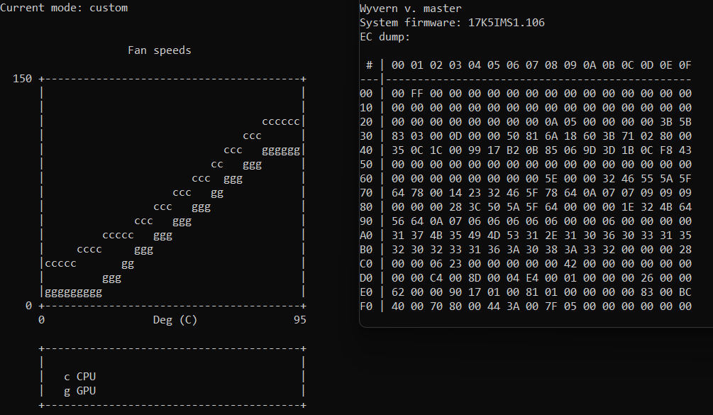

# Wyvern
A tool to alter fan modes of MSI laptops and something more...  
Heavily inspired by [isw](https://github.com/YoyPa/isw) and [msi-ec](https://github.com/BeardOverflow/msi-ec).

## Features
 - Fan profile chaging
 - Custom fan curve support
 - Battery charge threshold setting
 - Webcam lock

## Usage
TBD...

## Tested on
 - MSI Raider GE77 HX
> EC may be flaky sometimes. If some setting is a bit off - just try applying it again